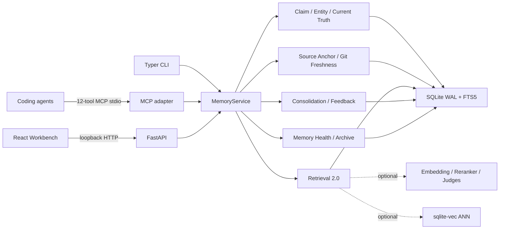
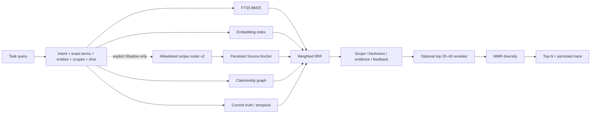

# MemoryOS V2.1 架构

## 原则

SQLite 是本机唯一事实源，MCP、HTTP、CLI 和 UI 是同一 `MemoryService` 的适配层。FTS5、确定性 Claim/Truth/Freshness 规则和 exact NumPy 保证完全离线可用；embedding、reranker、model judge 和 ANN 均可选且失败可降级。

MemoryOS 不做云同步、多用户账号、远程服务、全仓源码索引或源码 hoarding。

## 组件

## 数据模型与迁移

`0001_initial` 的 repositories、memories、sources、relations、embeddings、audit、settings 和 FTS5 原样保留。`0002_memory_intelligence` 新增：

- `entities`、`entity_merge_events`
- `claims`、`claim_evidence`、`claim_relations`
- `source_anchors`
- `retrieval_runs`、`memory_feedback`
- `consolidation_candidates`

`0003_reality_intelligence_hardening` 新增：

- `claim_identities` 与只追加的 `claim_versions`
- `possible_conflicts`
- `ann_index_state`
- `memory_health`

0001/0002 迁移是显式、不可变的 Alembic operation，不再引用运行时 `Base.metadata`。0003 对既有 claim 保守回填首个 version；迁移可降级再重放而不重复历史。

现有 V1 memory 不会被迁移脚本凭空补成 accepted claim；首次正常操作可保守、lazy normalize。备份格式为 V2 且显式接受 V1 import。生产 smoke 以真实 `0001_initial` DB 启动 packaged executable，验证自动升级和旧数据保留。

## Claim、Entity 与双时态 Truth

每个 Claim 绑定 exact evidence span。稳定 ClaimIdentity 指向 append-only ClaimVersion；每个版本保存 canonical predicate/object、polarity、modality、confidence、status、valid interval、transaction interval、reason 和 actor。Current Truth 先在 transaction time 截面选择当时可见版本，再按 valid time 求解，因此历史确认、遗忘和修订不会被当前行覆盖。

语义比较优先确定性 predicate registry，关系为 equivalent/supports/contradicts/independent。明确 pair 不会调用模型；只有 `uncertain/model_eligible` pair 才发送 bounded claim/evidence。每次结果、弃权或失败都持久化 PossibleConflict 审计信息，失败不得改变 accepted truth。

## Git-aware Freshness

Source Anchor 保存 repository stable key、commit/blob、path、language、symbol FQN/kind、line、excerpt/context hash。Python、TypeScript、JavaScript 和 Rust 使用真实 Tree-sitter grammar，只解析 anchor 文件；不支持语言退化到 bounded snippet/context hash。

Freshness lazy 计算并按 HEAD 缓存：

- `fresh`：blob 未变或 symbol/snippet 等价。
- `moved`：路径/行变化但证据可靠重定位。
- `suspect`：symbol 有实质变化但证据不足以断言 stale。
- `stale`：文件/symbol 删除或不再存在。
- `unknown`：仓库不可读、stable key 不匹配或语言不支持。

默认 context 排除 stale、显著降权并标记 suspect。Refresh 更新 freshness，并在有当前证据时生成 replacement candidate；不修改原 accepted fact。

## Retrieval 2.0

实现上分为 candidate retrieval、fusion、governance scoring、bounded rerank 和 diversity 五个阶段。生产路径固定执行既有 safe-hybrid topology 和 `legacy_raw_rrf_v1`；路由器只在显式、哈希绑定的 Shadow profile 下改变 topology，且与权重 Shadow 互斥。router v2 只按离散信号和意图原因码选择 immutable recipe，不产生未校准的 query-time 概率，也不使用数值阈值；无法分类时回退生产 recipe。

每个结果记录 FTS/vector/source-anchor/graph/temporal rank、fused score、scope、freshness、evidence count、reranker score 和 final reasons。每个通道还记录 requested/available/applicable/attempted/executed/contributing/degraded 状态与计数，避免把“配置了通道”误报为“通道工作了”。Shadow RRF 使用 `[0,1]` bounded fusion contract，Context Compiler 在消费前校验；实际融合 weights/K、reranker mode 和阶段耗时进入 RetrievalRun。Source Anchor 查询只读已持久化的 bounded symbol/path 证据，不触发全仓扫描。

Embedding 区分 query/document instruction。sqlite-vec 以 `<provider>/<model>/<dimensions>` namespace 持久化，写入 memory embedding 时同步 upsert；状态、item count、失败原因和重建时间进入主库。扩展禁用/不可用或查询失败时显式使用 exact NumPy fallback，FTS5 始终可用。路由 Shadow 的生产候选资格由独立 task-level 成对 Agent 聚合器判断；最差 repository/agent/recipe、安全、成本与时延任一门禁失败即保留冻结基线，且通过也不自动激活。

## Task-aware Context Compiler

Compiler 先构造严格 scope chain，再按 intent 要求 decision/constraint/failure/preference/state coverage。候选 utility 综合 relevance、confidence、freshness、evidence、feedback 和字符成本。预算内选择最小证据集，manifest 解释 include/exclude；同一 contested group 只要一边入选，就强制纳入双方。

## Consolidation、Health 与 Feedback

Consolidation 只处理跨独立 source、达到最小时间跨度的 active episodic claims。模型抽象必须只引用输入中允许的 supporting/counter memory IDs，并满足独立来源约束；非法输出降级为明确标注的 extractive candidate。输出 candidate/contested proposal、counterevidence 和 lineage，永不自动激活。

Memory Health 根据状态、更新时间、检索使用、证据和 accepted truth 角色生成分数、Hot/Warm/Cold/Archived 温度与解释。Archive 是逻辑且可逆的；系统阻止归档唯一 accepted current truth。只有 Cold/Archived 集合可 distill，结果仍是 agent-created candidate。

## Provider 边界

CandidateExtractor、ClaimExtractor、EmbeddingProvider、RelationshipJudge、Reranker、ConsolidationJudge 和 StalenessJudge 均暴露 provider/model、real/fixture、capabilities、timeout、max input 和 stats。OpenAI-compatible JSON 输出经 `extra=forbid` schema 与 evidence span 校验；异常统一转为 `ProviderError`，不写污染数据，也不记录完整 prompt。

## 部署

HTTP 强制 loopback。MCP 是 stdio 子进程。Windows onedir 包捆绑 migrations、Tree-sitter grammars、sqlite-vec、React dist、MemoryBench V2 和 CodingMemoryBench V2.1 report。V1 数据原地升级至 0003；写入状态转换始终在事务中完成。
