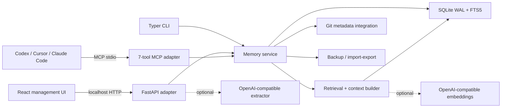
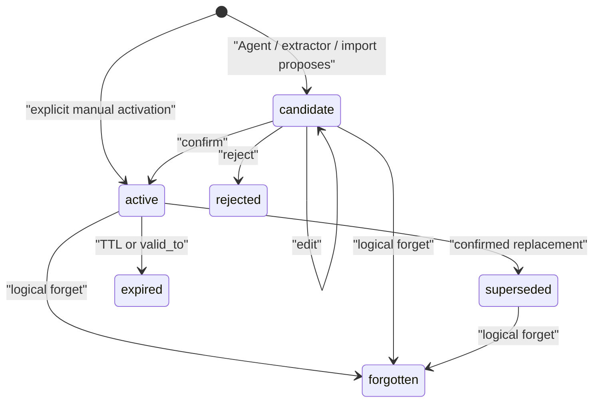

# MemoryOS 架构

## 设计目标

MemoryOS 在一台本机上为多个编码客户端提供同一套可追溯记忆。数据库是唯一事实源；MCP、HTTP、CLI 和 UI 只是不同适配层。默认路径完全离线，模型提取和 embedding 不是正常运行的前置条件。

V1 的明确非目标：不做云同步、多用户账号系统、自动源码索引、远程网络服务或后台遥测。

## 组件图

`memoryos.engine.MemoryService` 集中执行状态转换、冲突、过期、审计和来源规则，因此不同适配层不会产生不同语义。

## 数据模型

Alembic `0001_initial` 迁移创建以下表：

- `repositories`：稳定仓库键与当前路径/remote/branch 元数据。
- `memories`：作用域、类型、语义键、正文、状态、置信度、重要性、有效期和创建者。
- `sources` + `memory_sources`：来源引用、脱敏 excerpt、SHA-256 内容哈希及多对多关联。
- `relations`：包括 supersession 在内的记忆关系。
- `embeddings`：可选 provider/model/vector 索引。
- `audit_events`：不可由常规忘却操作删除的行为记录。
- `settings`：持久化设置。
- `memory_fts`：由 SQLite trigger 同步的 FTS5 虚拟表。

作用域从宽到窄为 `user → workspace → repository → branch → task`。Context builder 只组合请求指定的仓库、分支和任务链；分支记忆不会泄漏到其他分支。

## 生命周期

同一作用域和语义键上已有 active 记忆时，普通 `confirm` 返回冲突，而不是静默覆盖。用户必须选择：

- `supersede`：旧记忆变为 `superseded`，新记忆激活，建立双向可解释链。
- `keep_both`：保留两条 active 记忆，记录解决理由。
- `reject`：候选项转为 `rejected`。

所有转换在同一数据库事务内更新记忆、关系、FTS 及审计记录。

## 写入和读取流程

### 写入

1. Pydantic 以 `extra=forbid` 校验请求。
2. 正文和来源 excerpt 经密钥模式脱敏；excerpt 按配置上限截断。
3. 创建 source 和 content hash，再创建 candidate/active 及审计事件。
4. SQLite trigger 使 FTS5 索引与主表同步。
5. 如已配置 embedding provider，可为记忆建立向量；失败时搜索回退到 FTS5。

### 搜索

FTS5 BM25 先给出候选，排名再合并 lexical 0.32、semantic 0.22、scope 0.18、importance 0.12、recency 0.08 和 confidence 0.08。未配置 embedding 时只使用 FTS5 基线，返回的 `mode` 会如实标记为 `fts5`、`hybrid` 或 `fts5-fallback`。

### Context builder

Context builder 先限定作用域，再排名、去重和按字符预算裁剪，最后组织为：

1. current decisions
2. active constraints
3. known failures / do not repeat
4. relevant preferences
5. current branch / task state
6. historical / superseded（仅显式请求）

每条输出包含 memory ID 和 provenance reference，便于 Agent 继续调用 `memory_explain`。

## 持久化与并发

- SQLAlchemy session 上下文在成功时 commit、失败时 rollback。
- SQLite 启用 WAL、foreign keys 和 5,000 ms busy timeout。
- WAL 和 busy timeout 负责协调并发连接；16 条/8 线程的验收测试验证了完整写入。
- MCP、HTTP 和 CLI 使用同一 `data_dir` 时读写同一数据库；真实 stdio 子进程与 HTTP 客户端的交叉测试验证了持久化。

## 部署拓扑

V1 只支持单机 loopback 部署。HTTP 服务拒绝 `0.0.0.0`、LAN IP 和非 loopback 主机。MCP 以 stdio 子进程形式由客户端启动，不开放网络端口。Windows 发行包捆绑 Python runtime、迁移和前端静态产物。
