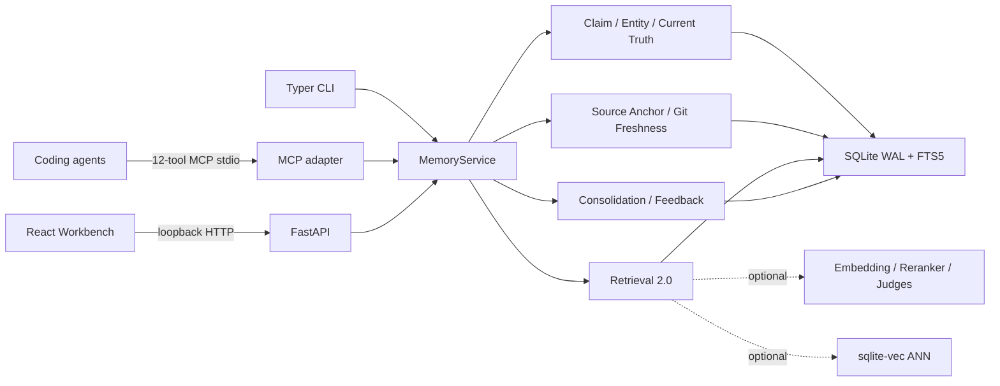
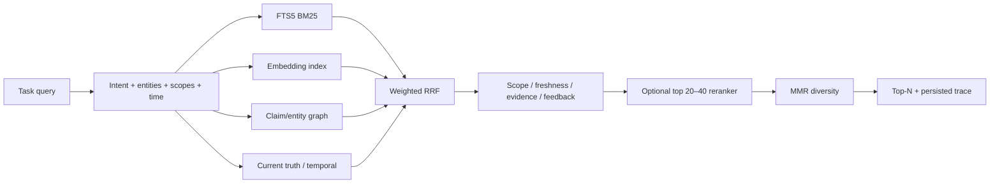

# MemoryOS V2 架构

## 原则

SQLite 是本机唯一事实源，MCP、HTTP、CLI 和 UI 是同一 `MemoryService` 的适配层。FTS5、确定性 Claim/Truth/Freshness 规则和 exact NumPy 保证完全离线可用；embedding、reranker、model judge 和 ANN 均可选且失败可降级。

MemoryOS 不做云同步、多用户账号、远程服务、全仓源码索引或源码 hoarding。

## 组件

## 数据模型与迁移

`0001_initial` 的 repositories、memories、sources、relations、embeddings、audit、settings 和 FTS5 原样保留。`0002_memory_intelligence` 新增：

- `entities`、`entity_merge_events`
- `claims`、`claim_evidence`、`claim_relations`
- `source_anchors`
- `retrieval_runs`、`memory_feedback`
- `consolidation_candidates`

现有 V1 memory 不会被迁移脚本凭空补成 accepted claim；首次正常操作可保守、lazy normalize。备份格式为 V2 且显式接受 V1 import。生产 smoke 以真实 `0001_initial` DB 启动 packaged executable，验证自动升级和旧数据保留。

## Claim、Entity 与双时态 Truth

每个 Claim 绑定 exact evidence span，并包含 scoped subject entity、canonical predicate/object、polarity、modality、confidence、status、valid interval、recorded time 和 stale state。Entity alias 仅在相同 scope/type 解析，merge 通过 redirect 和 event 保持可审计、可逆语义。

语义比较优先确定性 predicate registry，关系为 equivalent/supports/contradicts/independent；可选 judge 只处理规则不确定的 bounded claim/evidence。Current Truth 同时按 valid time 和 known-at 过滤，并返回 accepted、conflicting、evidence、freshness 与 resolution history。

## Git-aware Freshness

Source Anchor 保存 repository stable key、commit/blob、path、language、symbol FQN/kind、line、excerpt/context hash。Python、TypeScript、JavaScript 和 Rust 使用真实 Tree-sitter grammar，只解析 anchor 文件；不支持语言退化到 bounded snippet/context hash。

Freshness lazy 计算并按 HEAD 缓存：

- `fresh`：blob 未变或 symbol/snippet 等价。
- `moved`：路径/行变化但证据可靠重定位。
- `suspect`：symbol 有实质变化但证据不足以断言 stale。
- `stale`：文件/symbol 删除或不再存在。
- `unknown`：仓库不可读、stable key 不匹配或语言不支持。

默认 context 排除 stale、显著降权并标记 suspect。Refresh 更新 freshness，并在有当前证据时生成 replacement candidate；不修改原 accepted fact。

## Retrieval 2.0

每个结果记录 FTS/vector/graph/temporal rank、fused score、scope、freshness、evidence count、reranker score 和 final reasons。V1 fixed linear search 保留为 baseline；V2 使用 RRF。Embedding 区分 query/document instruction。`VectorIndex` 提供 exact NumPy baseline 和可选 `sqlite-vec` adapter；扩展不可用返回空 capability，由核心 exact/FTS 路径继续运行。

## Task-aware Context Compiler

Compiler 先构造严格 scope chain，再按 intent 要求 decision/constraint/failure/preference/state coverage。候选 utility 综合 relevance、confidence、freshness、evidence、feedback 和字符成本。预算内选择最小证据集，manifest 解释 include/exclude；同一 contested group 只要一边入选，就强制纳入双方。

## Consolidation 与 Feedback

Consolidation 只处理跨独立 source、达到最小时间跨度的 active episodic claims。输出 candidate/contested proposal、counterevidence、source memory IDs 和 `consolidated_from` lineage，不自动激活。Feedback 必须引用真实 RetrievalRun 中的 memory，写入 audit-friendly row，只改变未来 utility factor。

## Provider 边界

CandidateExtractor、ClaimExtractor、EmbeddingProvider、RelationshipJudge、Reranker、ConsolidationJudge 和 StalenessJudge 均暴露 provider/model、real/fixture、capabilities、timeout、max input 和 stats。OpenAI-compatible JSON 输出经 `extra=forbid` schema 与 evidence span 校验；异常统一转为 `ProviderError`，不写污染数据，也不记录完整 prompt。

## 部署

HTTP 强制 loopback。MCP 是 stdio 子进程。Windows onedir 包捆绑 migrations、Tree-sitter grammars、React dist 和 MemoryBench report。V1 与 V2 客户端使用同一 `data_dir` 时读取同一数据库；写入状态转换始终在事务中完成。
