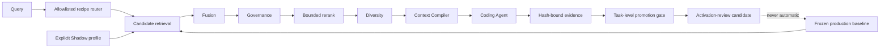

# MemoryOS 开发问题总复盘

> 快照日期：2026-08-13
>
> 代码基线：`2282cb9`（Retrieval Plan Routing Shadow）
>
> 覆盖范围：V1.0、V2.0、V2.1 Reality Intelligence、V2.2 真实工作负载、检索权重校准与查询自适应路由

本文集中记录 MemoryOS 开发过程中实际遇到的问题、失败实验、根因、处理方式、验证证据和仍未解决的边界。它是可持续更新的工程问题台账，不是产品宣传稿，也不是效果报告。

信息来源包括 Git 历史、测试、机器报告、冻结 benchmark artifact，以及开发会话中发生但没有进入机器报告的资源事件。没有留存证据的资源事件会明确标为“会话级记录”，不会伪装成可复现实验结果。

状态含义：

- **已解决**：已实现修复并有自动化回归证据。
- **已缓解**：风险被隔离、降级或门禁控制，但根因或产品化工作尚未完全结束。
- **开放**：仍缺数据、外部条件或工程能力，不能宣称完成。
- **按设计保留**：不是缺陷，而是经过明确取舍后保留的边界。

## 一、结论先行

| 主题 | 当前结论 | 状态 |
| --- | --- | --- |
| 产品定位 | MemoryOS 是面向 coding agent 的本地、证据化、时态感知记忆与上下文治理层，不是 Codex 或其他 Agent 的替代品 | 已明确 |
| 正确性与安全 | 时间穿越、模型越权、路径逃逸、备份注入、候选截断、ANN 故障等已做系统性对抗修复 | 已解决/持续回归 |
| “魔法数字”治理 | 所有关键常量已被分类、命名、冻结、记录来源，并禁止无证据自动激活；但部分数值仍是启发式基线 | 治理已解决，数值校准开放 |
| 训练权重 | 公共数据只得到一个 FTS/vector 相对比例候选，真实管线门禁未通过；AI 因果训练仍只有一个可用标签 | 未完成生产校准 |
| 九个有效配对 | 九个协议有效 full/minus-memory 配对中只有一个功能结果方向不同，因此只有一个因果标签；其余八个不是失败数据，而是零方向证据 | 结论有效，样本不足 |
| 外部现成权重 | 预训练 embedding 可以直接复用，检索融合/治理权重不能不经校准直接移植 | 按设计拒绝直接替换 |
| 查询自适应 | 已从“一个数字管所有查询”改为 allowlist recipe + 五阶段检索；当前只运行 Shadow | 架构完成，效果证据开放 |
| 企业级 | 核心审计、迁移、备份、门禁和可观测性已具备企业工程雏形；多租户、RBAC、静态加密、云同步、SLO 等尚未具备 | 开放 |

最重要的判断是：**当前瓶颈不是优化器算不出权重，而是缺少足够独立、协议有效、能够改变真实 Agent 成败的因果标签。** 继续复制同一标签生成器、盲目增加相似仓库或直接拿别人的融合权重，都不能解决这个问题。

## 二、开发阶段与主要转折

| 阶段 | 当时的主要问题 | 形成的处理原则 |
| --- | --- | --- |
| V1.0 基础产品 | 记忆生命周期、scope、冲突、来源、备份、接口和 Windows 交付需要同时落地 | SQLite 为唯一事实源；Agent 写入 candidate-first；适配层共享同一服务 |
| V2.0 Intelligence | 搜索只有固定线性分数，缺乏语义、时态、图关系和代码来源新鲜度 | 多通道检索、RRF、Source Anchor、显式 trace 与可降级 ANN |
| V2.1 Reality | 可变行会覆盖历史；模型可能越权改真值；旧记忆无限积累；向量能力可能只存在于 benchmark | ClaimVersion 双时态、bounded judge、持久 ANN、可逆 health/archive |
| 对抗“拷打” | 正常测试通过不代表对恶意输入、故障和边界安全 | 增加 1,000+ 行对抗测试，修复恢复、鉴权、时间、检索截断和 provider 故障 |
| 真实 Agent 回放 | fixture 容易被误当效果证据，真实 Agent 可能根本不调用记忆，未来答案可能泄漏 | 仓库级三条件回放、MCP 使用门、Git 时间验证、隔离 scorer、canary 和 `effect_claim=none` |
| 权重校准 | 固定权重没有数据出处；银标可能过耦合；人类标注不作为依赖 | 证据分层、AI Jury 弱监督、真实 full/minus 因果标签、Shadow 与 sealed promotion |
| 公共先验 | 外部数据能训练，但不等于对本产品真实 Agent 有效 | 只允许生成初始化先验；同候选池回放和最差仓库门禁失败即保留生产基线 |
| 查询自适应 | 单一全局权重无法适配 exact、semantic、relational、temporal 等不同查询 | immutable recipe、五阶段执行、离散原因码、能力遥测、路由 Shadow |

## 三、产品与架构问题

### P01：一度无法一句话说清产品是什么

- **现象**：开发中反复出现“做文本还是做 Agent”“和 Codex 有什么区别”“是否能成为企业级项目”等问题。
- **根因**：早期交付以功能清单为中心，没有把系统边界和独特价值压缩成稳定定义。
- **处理**：把产品定义为 coding agent 的持久化记忆与上下文治理层。Agent 负责推理和执行；MemoryOS 负责跨会话事实、证据、时间、scope、冲突、检索和审计。
- **状态**：已明确。仍保持单机单用户边界，不冒充完整企业知识平台。
- **证据**：[架构](../ARCHITECTURE.md)、[安全边界](../SECURITY.md)、[项目状态](../PROJECT_STATUS.md)。

### P02：接口多，容易产生多套业务逻辑

- **现象**：MCP、HTTP、CLI 和 UI 都能操作记忆，如果各自实现规则，会产生行为漂移。
- **根因**：多入口产品天然有重复实现风险。
- **处理**：SQLite 是本机唯一事实源，所有入口适配同一个 `MemoryService`；迁移、审计、检索和生命周期不在适配层复制。
- **状态**：已解决，持续由接口与 package smoke 回归。

### P03：文本能力与源码收藏边界容易混淆

- **现象**：向“文本方向”发展可能滑向全仓抓取、源码向量化或云端知识库，扩大隐私面。
- **根因**：检索效果和数据最小化之间存在天然张力。
- **处理**：Source Anchor 只读取调用方明确指定的文件，保存 bounded excerpt、hash、symbol 和 commit 元数据；不扫描、分块或收藏整个仓库。
- **状态**：按设计保留。

### P04：把真值、检索效用和治理温度混在一个分数里

- **现象**：如果 feedback、health 或检索分数能直接改变 accepted truth，模型或用户点击会污染事实。
- **根因**：早期“分高即更真”的直觉不适用于可审计记忆系统。
- **处理**：Truth、retrieval utility、health governance 三条路径分开；feedback 只影响效用，health 只控制治理，模型结果只能产生 candidate/possible conflict。
- **状态**：已解决。

### P05：一个全局权重向量控制所有查询

- **现象**：exact code lookup、语义问题、依赖关系和时间问题共享同一通道比例和后处理流程。
- **根因**：固定 scorer 易实现，但把不同 query intent 压成同一优化问题；一个数字即使在平均指标上更好，也可能伤害某类查询。
- **处理**：引入版本化 `RetrievalPlan` registry，只能从 exact、semantic、relational、temporal、complex 和 safe-hybrid 等 immutable recipe 中选择；执行拆为 candidate、fusion、governance、rerank、diversity 五阶段。
- **状态**：架构问题已解决，recipe 效果尚未证明，当前只允许 Shadow。
- **证据**：[架构的 Retrieval 2.0](../ARCHITECTURE.md)、[路由协议](../benchmarks/ai_calibration_v1/README.md)、[路由测试](../tests/test_retrieval_routing.py)。

### P06：路由器自身又引入伪概率和阈值

- **现象**：第一版 query planner 可能把规则输出包装成看似精确的 confidence，再用阈值决定执行。
- **根因**：没有校准集时，规则命中度被错误表达为概率，制造了新的魔法数字。
- **处理**：router v2 只输出离散特征和稳定 reason code，不输出未校准概率，不用数值阈值控制执行；无法分类时 fail closed 到 safe-hybrid。
- **状态**：已解决。

### P07：声明启用了通道，不代表通道真的生效

- **现象**：配置中写着 vector/reranker，不代表 provider 可用、候选适用、调用成功或结果真正参与最终上下文。
- **根因**：过去 telemetry 只记录“请求了什么”，缺少“实际执行了什么”。
- **处理**：每个通道持久化 requested、available、applicable、attempted、executed、contributing、degraded、计数和降级原因；同时记录实际 reranker、融合参数、score contract 和阶段耗时。
- **状态**：已解决。

## 四、正确性、安全与数据完整性问题

这些问题主要在对抗测试阶段暴露。对应回归集中在 [tests/test_adversarial_hardening.py](../tests/test_adversarial_hardening.py)、[tests/test_api_security.py](../tests/test_api_security.py) 和 [tests/test_v21_hardening.py](../tests/test_v21_hardening.py)。

| ID | 遇到的问题 | 根因 | 处理结果 | 状态 |
| --- | --- | --- | --- | --- |
| C01 | future memory 可经 graph candidate 重新进入历史查询 | 时间过滤只覆盖主候选，不覆盖图扩展 | 所有候选通道统一执行 known/valid-time 与 scope 门禁 | 已解决 |
| C02 | mutable current row 无法完整回答“当时知道什么” | 世界有效时间与数据库知识时间被混为一谈 | `ClaimIdentity` + append-only `ClaimVersion`，同时支持 valid-time/transaction-time | 已解决 |
| C03 | 未来支持可能被误当当前替代，进而归档唯一真值 | archive 保护未严格限定当前有效支持 | 只计当前有效、非 stale、非 archived、active 的 alternative | 已解决 |
| C04 | relationship model 可能用不确定输出改写 accepted truth | 模型判断和状态转换耦合 | 确定性规则优先；模型仅看 bounded pair；失败/abstain 只记审计 | 已解决 |
| C05 | 导入的 Source Anchor path 可能逃出仓库 | 只校验字符串路径，没有在解析 symlink 后复验 | create/refresh 时以真实路径重新验证 repository containment | 已解决 |
| C06 | localhost 不同端口可能复用 UI cookie；状态型读取可匿名改变计数 | 只把 host 当同源，低估读取副作用 | 精确 scheme+host+port Origin；状态型读取也要求 token | 已解决 |
| C07 | embedding/ANN 在记忆提交后失败可能造成 500 或伪装成空结果 | 可选索引步骤和主事务边界不清 | 主记忆提交保留；非法/空/非有限向量被拒；ANN 显式降级 exact/FTS | 已解决 |
| C08 | `valid_from > valid_to` 等非法时间区间可进入候选更新 | 边界校验不完整 | schema 与服务层同时拒绝反向区间 | 已解决 |
| C09 | consolidation 可能把 counterevidence 混进 supporting evidence | 只校验 ID 存在，未校验极性和集合交叠 | support/counter 白名单、互斥和独立来源校验；不合格降级 candidate | 已解决 |
| C10 | context usage 会统计实际没放进预算的记忆；争议组可被切半 | 选择、预算和记账不是原子操作 | 只计实际落入上下文的记忆；contested group 原子纳入或整体跳过 | 已解决 |
| C11 | scope/TTL 在 FTS cutoff 后过滤，可能让大量无效高分候选挤掉合法候选 | eligibility 与候选截断顺序错误 | scope、TTL 等硬过滤前移；offset 在足够大的候选窗后应用 | 已解决 |
| C12 | ZIP/JSONL 可触发超大解压、非有限 embedding 或半写入 | 导入信任 manifest，缺少资源与语义上限 | entry/总大小/记录数/维度/finite/schema 全校验，事务失败全回滚 | 已解决 |
| C13 | 恢复库可能缺表/索引、注入 trigger 或含语义非法行 | 只做 SQLite `integrity_check` 不够 | 与现场生成 schema 签名比较，隔离迁移，原子激活，失败回滚 | 已解决 |
| C14 | 恢复后外部 ANN cache 可能与新数据库“数量碰巧相同”而静默错配 | cache identity 没有绑定完整数据世代 | 恢复/import 一律使 ANN 状态失效并重建 | 已解决 |
| C15 | Agent 可以 commit、改 Git config/hook/alternate，影响宿主捕获或评分 | 把被测仓库的 `.git` 当可信控制面 | 固定 base 捕获 patch；宿主 Git 前检查 `.git`，禁用 hooks/config/diff/textconv | 已解决 |
| C16 | future solution、隐藏 scorer、memory DB 或 canary 可能泄给 Agent | 早期 A/B 缺少真正的执行隔离 | base-only checkout、sidecar、隐藏评分 checkout、networkless scorer、canary 扫描 | 已缓解 |

对抗修复的关键经验是：**“正常路径能跑”与“事实不会被污染”是两种不同的验收。** MemoryOS 后续所有生产候选都必须同时通过功能回归和 fail-closed 安全门。

## 五、评测、数据集与权重问题

### E01：最初的 benchmark 只能证明 harness，不能证明产品有效

- **现象**：50-task deterministic fixture 可以全部运行并计算 bootstrap，但没有真实 coding-agent endpoint 与凭据。
- **风险**：把管线自测误写成“MemoryOS 提升了真实模型”。
- **处理**：证据类型强制区分 `deterministic_fixture` 与 `real_coding_agent`；缺少真实 endpoint 时记录 `external_blocker` 和 `effect_claim=none`。
- **状态**：已解决。历史 V2.1 报告保持原样，不能被后来的一小批真实运行倒改。

### E02：benchmark 输入和 gold 混在一起会产生泄漏

- **现象**：运行时若能读取 qrels、官方 patch 或 scorer source，即使满分也没有意义。
- **处理**：runtime payload 与 gold 物理分离、分别哈希；builder 不读 qrels；未来 solution object 不挂载；满分强制 warning。
- **状态**：已解决。

### E03：没有数据时，固定权重没有可辩护出处

- **现象**：FTS、vector、graph、temporal、freshness、feedback、RRF、MMR 等常量主要来自工程经验。
- **根因**：早期优先完成可用系统，缺少与 MemoryOS feature schema 对齐的公开标注集。
- **处理**：先把它们改名为 `frozen heuristic baseline`，禁止暗示为训练最优；再建立校准数据、profile lineage、Shadow 和 promotion gate。
- **状态**：治理已解决，部分数值仍开放。

### E04：第一批 Git silver 数据存在标签耦合

- **数据**：7 个固定公开仓库，300 queries、3,656 candidates、9,600 judgments，train/dev/test 按 repository 切分。
- **问题**：path overlap 是可复现 proxy，却不等于“这条记忆对 Agent 完成任务有用”；从同一生成器再复制更多样本只会放大同一偏差。
- **处理**：明确标为 silver；保留 future/cross-scope hard guard；增加来源集中度、仓库重叠、留一来源和 worst-slice 审计；禁止 silver 改 truth/health 或直接批准生产权重。
- **状态**：已缓解，不能作为生产 gold。
- **证据**：[校准数据说明](../benchmarks/calibration_v1/README.md)。

### E05：模型盲评不能冒充人类 gold

- **过程**：两名有效 AI reviewer 各判断 1,922 个 pair，第三角色仲裁 527 个核心分歧。
- **问题**：relevance raw agreement 为 75.70%，但 Cohen's κ 仅 0.203；主要由大量 relevance=0 类抬高表面一致率。安全判断更稳定，agreement 97.66%、κ 0.834。
- **处理**：产物标为 `model_adjudicated_provisional`，只用于 rubric 和主动学习诊断，不参与生产权重拟合。
- **状态**：已正确降级，不是 gold。
- **证据**：[模型盲评报告](../benchmarks/human_review_v1/model_review/README.md)。

### E06：Reviewer A 发生盲评隔离协议违规

- **现象**：初始 reviewer A 为寻找响应枚举/验证器入口，执行了项目范围文本搜索，超出“只允许三个文件”的约束。
- **风险**：即使没有看到 qrels/control，也不能继续宣称该轮严格盲评。
- **处理**：整轮作废，不使用任何输出；更换独立 reviewer A2；事件永久进入 protocol audit。
- **状态**：已解决并留痕。
- **经验**：评测协议合规不能按“看起来没泄漏标签”事后宽免；越界即失效。

### E07：用户不依赖人工后，AI-only 路线仍不能把 AI 当真值

- **问题**：单模型评分既有顺序偏差，也可能与 Agent 的真实执行效用不同；同一 provider 伪装多个模型名不构成独立证据。
- **处理**：AI Jury 要求至少三个 provider、三个 canonical model family、双顺序 pairwise judgment、provider-reported revision 与 prompt/response/runtime hash；聚合只作不确定性加权弱监督。
- **状态**：协议已完成，当前只有一个有效 provider/model family，证据门未满足。

### E08：真实 Agent 可能不调用记忆

- **现象**：给 Agent 配了 MCP，不等于 Agent 实际调用；一次 Pylint repeat 因零次 mandatory `memory_context` 调用而失效。
- **处理**：非 baseline 条件必须有成功 MCP audit，MemoryOS 还必须有对应 `RetrievalRun`; safe-but-non-exact 调用允许结束但使样本无效。
- **状态**：已解决，违规样本不重试、不计标签。

### E09：九个有效配对为什么只有一个因果标签

当前 readiness 中的九个 protocol-valid full/minus-memory pair 分布如下：

| 批次 | 有效 pair | 结果 | 可用因果标签 |
| --- | ---: | --- | ---: |
| Requests 6028 | 2 | 1 个 full 成功/minus 失败；1 个双臂成功 | 1 |
| Cross-repository v1 | 3 | 2 个双臂成功；1 个双臂失败 | 0 |
| 后续 label-seeking v1/v2 | 4 | 全部双臂同结果 | 0 |
| **总计** | **9** | **1 个 discordant，8 个 unchanged** | **1** |

这不是训练程序“只成功了 1/9”，而是因果标签定义故意严格：只有在相同 prompt、runtime、task、scorer 和资源条件下，唯一差别为目标记忆，且两臂功能成败不同，才能把方向归因给该记忆。

八个 unchanged pair 的常见原因：

1. 强 Agent 在没有目标记忆时也能解决任务，形成 both-pass。
2. 任务或预算过难，记忆不足以挽救，形成 both-fail。
3. 记忆改变了搜索路径、token 或耗时，却没有改变二元功能结果。
4. 重复运行不是独立任务，不能通过重复同一例子放大统计权重。

因此，盲目再找 20～30 个仓库不保证产生标签。更有效的策略是先锁定 scorer，再选择“存在明确、截止时点有效、可能改变架构发现路径”的任务，并保持 repository、task、agent 和顺序多样性。

### E10：Hidden scorer 自身制造了假标签

- **事件**：label-seeking v1 的 4 个 raw pair 中有 3 个在 post-run audit 被判无效。
- **具体问题**：一个 scorer 漏掉已有 runtime field；一个把官方 API 形状当成唯一正确实现，拒绝等价 lazy-loading 架构；一个隔离执行时漏掉 Agent 新增 helper 的 dependency closure。
- **后果**：两个表面 discordant observation 被全部取消，合格训练标签为 0。
- **处理**：scorer 必须先验证 base fail / official solution pass，再加入 known-equivalent implementation；运行后仍做语义审计；任何 scorer 缺陷使整对失效。
- **状态**：已解决当前案例，scorer equivalence 仍是每批数据的持续风险。
- **证据**：[label-seeking v1](../benchmarks/real_workload/swebench_verified/label_seek_v1/README.md)、[v2](../benchmarks/real_workload/swebench_verified/label_seek_v2/README.md)。

### E11：看见结果后重跑、复用 arm 或改分区会污染实验

- **风险**：失败后只重跑不喜欢的 arm、把有利任务移到 train、或拿 test 调正则，会产生选择偏差。
- **处理**：运行前冻结 manifest、partition、run order、runtime 和 scorer；resume 必须匹配派生 manifest、runtime、prompt、profile 与单臂协议 hash；test/promotion 永不进入拟合或超参选择。
- **状态**：已解决。

### E12：把重复 Agent 执行当独立样本会制造虚假置信度

- **问题**：同一个 task 多个 repeat 高度相关，直接按行 bootstrap 会缩窄 CI。
- **处理**：先按 task 聚合 agent/repeat，再对 task bootstrap；要求完整 task×agent×repeat matrix，并单独检查 worst-agent。
- **状态**：已解决。

### E13：公共预训练先验离线变好，真实管线仍不够好

- **实验**：SWE-Gym + `BAAI/bge-small-en-v1.5` 给出 19.25% FTS / 80.75% vector 的候选相对比例；graph、temporal、RRF K、MMR 和安全门保持冻结。
- **离线结果**：repository-macro NDCG@10 与 required Recall@5 点估计改善。
- **真实管线回放**：52 queries / 2 repositories，NDCG@10 从 0.49611 到 0.51330，95% CI 为 -0.00847～0.04612；Pandas 的 NDCG 和 Recall 均回退。
- **处理**：门禁返回 `retain_frozen_baseline`，生产仍为 FTS/vector 50/50。
- **状态**：候选被正确拒绝。
- **证据**：[public RRF Shadow artifact](../benchmarks/ai_calibration_v1/evidence/public-rrf-shadow-v1.json)。

### E14：一次“记忆有帮助”不能证明新权重有帮助

- **现象**：pytest 真实 Agent probe 中 full-memory 成功、minus-memory 失败。
- **错误归因风险**：该对照只改变“有没有目标记忆”，没有比较候选 19/81 权重与冻结 50/50 权重。
- **处理**：标记为 memory-presence evidence，不生成 weight-training observation；权重必须走 baseline-weight vs candidate-weight 的同池成对 Shadow。
- **状态**：已解决归因问题，权重证据仍开放。

### E15：外部现成权重不能直接拿来替换生产配置

- **可以复用**：预训练 embedding/reranker 模型及其固定 revision，例如本次真实使用的 BGE。
- **不能直接复用**：FTS/vector/graph/temporal 融合系数、freshness/scope/feedback 因子、RRF K、MMR 和 query recipe，因为它们依赖本项目的 feature 定义、候选池、embedding、数据分布和安全门。
- **处理**：外部数据只产生版本化初始化 prior，必须经过本地真实管线、worst-slice、因果 Shadow 和 sealed promotion。
- **状态**：按设计拒绝“拿来即生产”。

## 六、“魔法数字”到底解决到什么程度

成熟系统并不会把所有数字都训练掉，而是先区分数字的职责：

1. **安全不变量**：跨 scope、future、stale、privacy、truth-state 等必须是硬门，不能靠损失函数交易。
2. **可学习效用参数**：检索通道相对权重、部分 rank feature 可以从独立数据学习，但只能生成 candidate。
3. **运行资源边界**：candidate pool、rerank window、超时、日志上限应由容量测试和 SLO 调整，不应伪装成相关性权重。
4. **产品策略默认值**：TTL、consolidation 最少来源/天数等需要命名、版本化、可配置和审计，不一定适合端到端训练。

| 数字组 | 当前例子 | 当前性质 | 还需要什么证据 |
| --- | --- | --- | --- |
| 通道融合 | FTS 1.0、vector 1.0、graph 0.82、temporal 0.90 | 冻结启发式生产基线 | 多仓库真实 Agent baseline/candidate Shadow |
| 公共候选 | FTS 0.3851、vector 1.6149 | 被拒绝的非生产先验 | 至少 3 个真实回放仓库、正 CI 下界、worst-repo 不回退 |
| RRF/MMR | `K=60`、`lambda=0.78` | 命名的结构启发式 | 分阶段消融、延迟/质量 Pareto 和因果任务证据 |
| 候选资源 | floor/cap 80/1000、rerank window 40 | 运行边界 | 规模测试、SLO、成本与截断 recall 曲线 |
| Truth/scope/time | future/cross-scope/stale 排除 | 安全不变量 | 不参与训练，只做不变式回归 |
| Consolidation | 3 个独立来源、跨 7 天 | 保守产品策略 | 不同组织数据上的误合并/漏合并审计 |
| Task TTL | 默认 7 天 | 显式产品默认值 | 用户工作流与过期错误率，而非检索点击率单指标 |
| Promotion 样本门 | 50 tasks、3 repos、10 sequences、2 unseen agents | 证据政策，不是模型权重 | 可在正式 power analysis 后版本化调整 |

所以准确回答是：

- **“数字从哪里来却说不清”这个治理问题已经解决。** 每个生产常量现在都有名字、版本、作用域和证据等级，未校准值明确写成 heuristic。
- **“所有数字已经被数据证明最优”并没有解决。** 当前没有足够因果标签支持这种说法。
- **一个数字管所有查询的架构问题已经解决。** 查询类型改由 allowlisted recipe 控制 topology，但 recipe 本身仍待真实数据验证。

## 七、训练为什么慢，以及训练工作有没有浪费

### T01：耗时主要不在拟合权重

真正的非负正则 pairwise fit 很快。慢的是每个标签之前的完整实验：

1. 拉取并校验固定仓库与 commit；
2. 构建 base-only 隔离工作区；
3. 启动 Agent 与 MCP sidecar；
4. full/minus 两臂分别进行数分钟推理；
5. 捕获 patch，在新 checkout 中运行 hidden scorer；
6. 校验 MCP 使用、时间、hash、canary、成本和协议；
7. 做重复、顺序平衡与 post-run scorer audit。

一对样本至少包含两次真实 Agent 会话；出现 TLS、容器或 scorer 问题时，该次运行还可能被判无效。因此“训练很慢”实质是**高可信标签采集很慢**，不是优化器迭代很慢。

### T02：已经完成的训练并非没用

已产出的价值包括：

- 建立可复现 silver 数据、AI Jury、真实消融、trainer、Shadow 和 promotion 全链路；
- 证明了路径银标和模型评审不能直接当生产 truth；
- 得到一个可运行的公共 BGE prior，并通过真实门禁发现其 Pandas 回退；
- 证明九个有效 pair 中只有一个可归因 success label，避免从 latency 或主观 patch 质量制造标签；
- 找出三类 hidden scorer 缺陷和一类 Agent 工具协议缺陷；
- 把生产权重与实验候选完全隔离，负结果没有伤害线上行为。

没有得到的是“全部生产权重已训练完成”。公共训练只识别了 FTS/vector 的相对比例候选，graph、temporal、RRF、MMR、pool、rerank 和治理系数都没有被这组数据识别。

## 八、基础设施与开发环境问题

### I01：Windows TLS 不稳定

- **事件**：多次出现 Schannel handshake failure 和 OpenSSL unexpected EOF，发生在 Agent 启动前或第二 arm 拉取时。
- **影响**：实验被中断；不能把网络故障当 Agent 失败。
- **处理**：事件单独保存为 invalidated infrastructure；增加 origin-validated offline bare cache reuse，并要求所有 pinned commit 已存在；允许严格 hash 匹配后复用已完成 arm。
- **状态**：已缓解，外部网络仍不受项目控制。

### I02：共享 bare mirror 并发 fetch 冲突

- **事件**：两个操作并发 fetch 同一个 bare mirror，产生基础设施失败。
- **处理**：失败尝试不计结果；后续避免同 mirror 并发刷新，优先使用已验证离线 cache。
- **状态**：已缓解。

### I03：Windows 长路径导致 scorer checkout 缺文件

- **事件**：Git for Windows legacy path limit 漏出一个 tracked fixture，可能让 hidden scorer 基于不完整工作区运行。
- **处理**：在隔离 repository 设置本地 `core.longpaths=true`，加入回归测试。
- **状态**：已解决。

### I04：CRLF/LF 造成证据 hash 跨平台漂移

- **现象**：相同 Git 文本在 Windows checkout 后可能变 CRLF，原始字节 hash 与 POSIX 不一致。
- **处理**：证据 hash 使用 Git-canonical LF bytes；同时解析并验证 JSON 语义，不通过简单忽略换行来降低完整性。
- **状态**：已解决。

### I05：大型数据、模型、容器和运行状态占用系统盘/内存

- **会话级事件**：开发中出现磁盘与虚拟内存压力，用户要求把实验放到 D 盘并释放虚拟内存。该事件没有独立 OOM trace，因此不作为性能 benchmark 结论。
- **处理**：大型 SWE-bench/SWE-Gym 数据、模型 cache、Agent workspace 和失效实验移到 `D:\MemoryOS-Lab`；Git 仓库只提交小型可发布 summary 与 hash，不提交 raw logs、容器状态或凭据。embedding 与 repository cache 支持 identity/hash 绑定复用，避免重复占用和重复计算。
- **状态**：已缓解。D 盘路径是本机实验约定，不是产品运行依赖；pagefile 管理仍属于操作系统职责。

### I06：中断后全部重跑成本过高，但随意 resume 会污染结果

- **矛盾**：长 Agent arm 完成后第二臂因网络失败，完全重跑浪费时间；直接复用又可能混入不同 runtime/profile。
- **处理**：resume 只接受完整 manifest、prompt、runtime、repository、provider、profile 和协议 hash 一致的单臂报告；否则 fail closed。
- **状态**：已解决。

### I07：Tree-sitter/可选依赖在 CI 和打包环境不稳定

- **现象**：Tree-sitter grammar 安装如果依赖环境偶然状态，CI 结果不可复现；PyInstaller 还会报告项目未使用的可选数据库/tzdata warning。
- **处理**：CI 确定性 provision Tree-sitter core dependency；sqlite-vec 保持可选并有 exact/FTS fallback；package smoke 验证真实 grammar、SQLite、MCP 和迁移，而不是用“无 warning”替代功能验证。
- **状态**：核心已解决，少量上游/可选依赖 warning 按已知边界保留。

### I08：CI audit cache 清理逻辑本身曾失败

- **现象**：新增 dependency/security gate 后，cache cleanup 需要单独修复。
- **处理**：调整 workflow 清理步骤，并保留 production dependency audit。
- **状态**：已解决，相关提交 `9ec4592`。

## 九、真实工作负载隔离仍存在的边界

V2.2 已显著收紧真实回放，但当前 pilot 仍有以下开放风险：

1. Codex nested sandbox 需要显式 `seccomp=unconfined` 外层例外；尚未换成测试过的自定义 seccomp profile。
2. 真实模型访问仍依赖较长寿命认证文件；尚未完成短期 credential 和 model-only egress gateway。
3. pilot 使用本地 image ID；正式确认性证据需要 registry-qualified digest。
4. ChatGPT 身份路径没有 provider cost meter，无法完成成本非回退门禁。
5. 当前真实 Agent/provider/model family 多样性不足。
6. raw run state 可能包含公开记忆、patch 和 Agent log，只能留在本地实验盘，不能直接发布。

这些限制详见 [V2.2 real-workload evaluation](REAL_WORKLOAD_EVALUATION_V2_2.md)。在它们解决前，MemoryOS 不作真实 Agent 效果提升声明。

## 十、发布、CI 与文档问题

### R01：工作分支验证不等于 merged-main 发布证据

- **问题**：分支上的测试通过，合并后依赖图、打包内容或迁移资源仍可能不同。
- **处理**：release evidence 必须在 clean `main`、合并后重新生成；package smoke 从真实 `0001_initial` DB 升级到 `0003` 并重启验证。
- **状态**：已解决。

### R02：历史事实与当前状态容易看起来矛盾

- **例子**：V2.1 发布报告记录当时没有真实 Agent endpoint；后来已经完成少量真实 Codex pair。旧报告不能被回写成“当时已完成”。
- **处理**：历史 artifact immutable；当前状态文档追加时间线说明。
- **状态**：按设计保留。

### R03：汇总文档数字可能滞后

- **事件**：根 README 仍写“五个有效 pair”，`PROJECT_STATUS.md` 仍只汇总最初 Requests 的两个 pair，而 readiness 已更新为九个；本次复盘同时修正为九个 pair / 六个 task。
- **根因**：详细 benchmark README 已更新，顶层摘要未同步。
- **处理**：以机器校验的 readiness 和 benchmark artifact 为事实源；摘要更新必须同时核对它们。
- **状态**：本次已解决。

### R04：公开仓库不能包含所有实验状态

- **问题**：raw logs、认证文件、临时 patch、模型 cache 和本机绝对路径既大又可能敏感。
- **处理**：只发布脱敏 summary、协议、manifest、hash 和必要公开 provenance；原始状态留在本地 D 盘并明确不可发布。
- **状态**：已解决流程，发布前仍需逐次审查。

## 十一、成熟架构最终采用的分层

我们没有继续寻找“一个神奇权重”，而是把成熟搜索/推荐系统常见的职责分离落实为三条平面：

- **执行平面**：只执行 immutable recipe 和有界阶段，不能运行 router 生成的任意代码或任意权重。
- **控制平面**：版本化 registry、profile、feature contract 和 hard safety gate。
- **证据平面**：真实 Agent paired run、hash lineage、task-level statistics、worst-slice 和 promotion decision。

这种分层解决了“一个数字管所有”和“实验候选偷偷进入生产”的架构风险，但不会自动补齐缺失数据。

## 十二、仍未解决的问题与优先级

### P0：下一阶段必须先做

1. **先做 10～15 个 exploratory routing/weight paired task，而不是直接扩到 20～30 个仓库。** 至少覆盖 3 个仓库、不同 query recipe 和 2 个 Agent；比较 frozen baseline 与 candidate，不再比较“有记忆/无记忆”来代替权重实验。
2. **先冻结和验证 scorer，再花 Agent 成本。** 每个 scorer 必须覆盖 base fail、solution pass、至少一个已知等价实现和 dependency closure。
3. **补齐真正的 AI Jury 多样性。** 需要两个额外 provider/model family；如果拿不到，就保持弱监督门禁失败，不能用同一 runtime 改名字代替。
4. **补全成本与隔离。** 引入 model-only egress gateway、短期 credential、自定义 seccomp 和 registry image digest。
5. **建立实验资源预算。** D 盘 lab 设 cache/invalidated/raw-state 保留策略、并发上限和磁盘水位；避免同时刷新同一 mirror。

### P1：P0 取得方向性证据后再做

1. 分阶段校准 FTS/vector、graph/temporal、RRF K、MMR 和 pool/window，不做一次性全参数搜索。
2. 用 quality/latency/cost Pareto 而不是单一平均 NDCG 选择候选。
3. exploratory 结果有稳定方向后，再决定是否值得投入 50-task sealed confirmatory matrix。
4. 若向企业级推进，单独设计多租户隔离、RBAC、静态加密、密钥管理、云同步、HA、SLO、审计导出和数据保留策略；不要把当前 loopback 单用户实现直接暴露到网络。

### 明确不要做

- 不从同一 silver 标签生成器无限复制数据来“解决过耦合”。
- 不把模型盲评叫 human gold。
- 不把 repeated run 当独立 task。
- 不因 latency 更快就制造 success label，除非事先冻结了独立效用目标。
- 不把 memory-presence 对照误当 weight 对照。
- 不把外部融合权重绕过本地 Shadow 直接写入生产。
- 不在看过 sealed test 结果后调参数或改分区。
- 不让任何训练、路由或 promotion 命令自动激活生产配置。

## 十三、问题带来的长期工程规则

1. **负结果必须发布。** both-pass、both-fail、scorer invalid、Agent protocol invalid 和 infrastructure invalid 都是不同结论，不能只保留 favorable run。
2. **来源比数值重要。** 每个 profile 必须绑定 dataset、code revision、feature adapter、model revision、train/dev rows 和 hash。
3. **安全门不可学习。** scope、time、stale、privacy、truth mutation 永远先于相关性优化。
4. **候选不等于激活。** offline fit → pipeline Shadow → real-agent Shadow → sealed promotion → human/owner activation 是不可跳级的链。
5. **按 task 统计。** Agent repeat 用于稳定性，不用于伪造样本量。
6. **评测器也要被评测。** scorer 必须接受等价实现，且 post-run audit 可以推翻原始标签。
7. **历史证据不可重写。** 新能力通过追加新 artifact 表达，不倒改旧报告的当时状态。
8. **可降级不等于静默。** optional provider、ANN、reranker 和 route 失败必须有明确 telemetry 和 fallback reason。
9. **资源故障与模型失败分开。** TLS、路径、磁盘、容器、timeout 和 Agent 功能结果使用不同状态码和统计口径。
10. **没有证据时最正确的动作可能是不改生产。** 本轮公共 19/81 先验被拒绝，正是门禁正常工作的结果。

## 十四、主要证据入口

- [当前项目状态](../PROJECT_STATUS.md)
- [实施决策，特别是第 34～46 条](../DECISIONS.md)
- [安全模型](../SECURITY.md)
- [V2.1 验收证据](ACCEPTANCE.md)
- [V2.2 真实工作负载协议](REAL_WORKLOAD_EVALUATION_V2_2.md)
- [Git silver 校准数据](../benchmarks/calibration_v1/README.md)
- [模型盲评与隔离事件](../benchmarks/human_review_v1/model_review/README.md)
- [AI-only executable calibration](../benchmarks/ai_calibration_v1/README.md)
- [Requests 真实 Agent 消融](../benchmarks/ai_calibration_v1/evidence/requests-6028-real-agent-ablation-v1.json)
- [跨仓库真实 Agent 消融](../benchmarks/ai_calibration_v1/evidence/swebench-cross-repository-real-agent-ablation-v1.json)
- [label-seeking 汇总](../benchmarks/ai_calibration_v1/evidence/swebench-label-seeking-real-agent-ablation-v1-v2.json)
- [公共 RRF Shadow 决策](../benchmarks/ai_calibration_v1/evidence/public-rrf-shadow-v1.json)
- [检索路由测试](../tests/test_retrieval_routing.py)
- [路由 promotion 测试](../tests/test_retrieval_routing_evaluation.py)

## 十五、维护约定

以后遇到新问题时，在本文追加以下最小字段：

1. 观察到的现象和日期；
2. 受影响的证据或产品路径；
3. 根因，以及它是代码、数据、scorer、Agent protocol 还是 infrastructure；
4. 是否看过 outcome 后才修改；
5. 修复、回归测试和 artifact hash；
6. 状态是已解决、已缓解、开放还是按设计保留；
7. 是否影响既有训练标签、权重、效果声明或生产配置。

本文不删除失败记录。问题解决后更新状态和证据，保留原始发生经过，以防同类错误被新的数据集、模型或运行环境重新引入。
