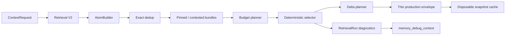

# MemoryOS V2.3 最小充分上下文

## 状态与结论

V2.3 已实现 Minimum Sufficient Context（MSC）的可回退生产路径：瘦响应、Token 分账、
Context Atom、按需证据、显式 Delta 游标、确定性去重、预算 Profile、MCP 工具 Profile
与独立 Context Efficiency Study。新路径不使用 LLM 压缩，不更改 Retrieval V2 的真相、
Freshness 或 Scope 安全语义。

当前默认仍是 `legacy`。已检入的 dry run 只证明协议、计量、哈希和发布门禁可运行；
它不包含真实 Provider Usage，不能证明 Token 降低或任务成功率非劣。因此当前
`effect_claim=none`，也没有自动激活路径。

## 边界与数据流



MSC 是 Memory、Claim、Source、Git Anchor、Truth 和 Freshness 之上的确定性编译视图。
`ContextAtom` 和 `ContextSnapshotRow` 都不是新真相源；删除 Snapshot 后仍能从主数据重建 Full
Context。MemoryOS 仍然不接管 Agent Loop、会话历史压缩或工具调度。

## 模式与兼容性

`MEMORYOS_CONTEXT_COMPILER_MODE` 只接受以下值：

| 模式 | 对调用者的响应 | 审计行为 |
| --- | --- | --- |
| `legacy` | V2.2 响应形状与字符预算语义 | 保留旧 RetrievalRun |
| `msc_shadow` | 仍返回 legacy | 同次召回编译 MSC，存储 payload/usage/error |
| `msc` | 返回 V2.3 瘦响应 | 存储完整诊断、策略和 Snapshot |

`ContextRequest.budget` 永久保留为 legacy text 字符预算。新 Token 预算只使用
`budget_tokens` 或 `budget_profile`，不对旧字段静默重解释。

MSC 生产响应只包含：

- `schema_version`、`mode`、`context_id`、`requires_base_context_id`；
- `retrieval_run_id`、`truth_state`、`text`、`usage`；
- 必要时的 `delta` 和 `fallback_reason`。

`sections`、`manifest`、`query_plan`、candidate features 和 reranker trace 不再重复注入 Agent，
而是保存在同一 `RetrievalRunRow`，由
`memory_debug_context(retrieval_run_id=...)` 读回当时的精确诊断，不重跑检索。

## Token 计量和预算

核心包默认提供确定性 `unicode-heuristic-v1` 估算器，并允许 Harness 注入与 Provider
模型对应的 exact counter。每次 MSC 响应记录 `counter_kind`、`tokenizer_id` 和
`counter_version`。`hard_token_budget=true` 只允许 exact counter；否则返回
`EXACT_TOKENIZER_REQUIRED`。

初始 Profile 是版本化的工程假设，不是效果结论：

| Profile | Token 上限 |
| --- | ---: |
| `tiny` | 384 |
| `small` | 768 |
| `medium` | 1536 |
| `large` | 3072 |

AUTO 根据确定性 intent/coverage/候选结构选择起始 Profile。完整 Pinned 约束或 Contested
Bundle 超出软预算时提高到 `minimum_safe_tokens`；手动 hard budget 不足时返回
`INSUFFICIENT_BUDGET`，不部分交付。预算对象是 MemoryOS 序列化的完整生产 payload，
不只是 `text`。

`ContextUsage` 分开 context text、payload overhead、delivered payload、delta、evidence、legacy
equivalent 与编译时延。编译器的 LLM input/output 固定为 0；如配置可选 Provider
embedding/reranker 但 Provider 没有返回完整 Usage，其他记忆操作 Token 标记为
`unavailable`，不伪造为 0。Agent Runtime 的 Provider Usage 始终是端到端权威数字，
不与估算分账重复相加。

## Atom、去重和安全约束

Atom 边界为 `INDEX / FACT / EVIDENCE / HISTORY`。`memory_context` 默认交付 FACT；
未结构化的普通 Memory 只以 `Relevant record` INDEX 出现，不伪装成已验证事实。
约束或唯一任务状态保留必要原文。`memory_context` 只接受 INDEX/FACT；EVIDENCE/HISTORY
必须通过 `memory_explain`（或完整历史工具）按需展开，传错入口会返回明确校验错误而不静默降级。
同一 Memory 中的 historical Claim 默认不会混入当前 FACT；只有显式历史请求才编译，并保留
`status=historical`。Claim 状态也参与规范身份，当前与历史表现不会被去重合并。

`atom_sha256` 覆盖规范事实、极性、限定词、Truth/Freshness、有效时间、证据指针版本
和渲染策略版本。因此文本不变但 fresh 变 suspect、resolved 变 contested 或证据移动时，
Delta 仍会强制 invalidation。

生产只激活 exact dedup：规范身份、极性、限定词、有效时间、Truth 和 Freshness
完全一致时，多个表现合并成一个 FACT，但保留所有 `source_refs` 和证据计数。
相反极性、不同时间窗口、不同 Freshness、约束/观察差异和 contested 两侧永不自动合并。
Embedding/Model Judge 语义去重仍为 Shadow-only。

## Evidence on Demand

V2.3 兼容扩展既有 `memory_explain`：

```text
memory_explain(
  memory_id,
  expected_atom_sha256,
  sections=[fact, evidence, freshness, relations, history],
  budget_tokens
)
```

无新参数的调用保持 legacy 响应。扩展调用在 Atom 已变更时返回 `CONTEXT_CHANGED`；
预算无法容纳完整请求 sections 时返回 `minimum_required_tokens`，不截断成误导证据。
即使一个 FACT 由多条等价 Claim 去重得到，合并哈希也会从当前真相重建并在一次调用中
返回所有当前证据。结构化 FACT 的展开严格按该 Atom 的 `claim_ids` 取证，不会夹带同一
Memory 中其他 Claim 的证据；显式空 sections 被拒绝，不会意外回退成默认扩展。

## Delta Context

首次不传 `previous_context_id` 时始终返回 full。后续请求显式携带上一次
`context_id`；服务端校验 Scope、TTL、policy hash、tokenizer/counter 和 full-text integrity，
然后比较 Atom hash 产生 added/changed/removed。

以下情况安全回退 full：Snapshot 缺失或过期、Scope/Policy/Tokenizer 不匹配、完整性失败、
Delta 达到 Full 的可配比例（初始 0.8）、或客户端显式要求 full。跨仓库游标只返回
`scope_mismatch` 并在新 Scope 重建，不泄露旧内容。Snapshot TTL 默认 7 天，清理按 Scope
且有批次上限。

Snapshot 被定义为可丢弃缓存，不进入 SQLite/JSONL 长期备份。Restore 会清空快照，
旧游标返回 `snapshot_unavailable` 并 full rebase。

## MCP 工具 Profile

Profile 在 MCP 进程启动时固定：

| Profile | 工具数 | 范围 |
| --- | ---: | --- |
| `all` | 12 | V2.2 兼容集，首版默认 |
| `core` | 6 | context/search/explain/current truth/propose/confirm |
| `governance` | 4 | forget/feedback/consolidate/refresh |
| `debug` | 2 | history/debug context |

启动命令和延迟加载建议见 [MCP_SETUP.md](../MCP_SETUP.md)。服务端 Profile 只减少暴露给客户端的
Schema；客户端是否把它编码为较少 Provider Token 必须以真实 Provider Usage 验证，不从
`estimated_schema_tokens` 直接推断。

## 存储、配置与复现

Migration `0005_context_efficiency` 为 RetrievalRun 增加 usage/policy/diagnostics/shadow JSON，并新增
`context_snapshots`。重要配置都使用 `MEMORYOS_` 环境变量前缀：

- `MEMORYOS_CONTEXT_COMPILER_MODE`；
- `MEMORYOS_CONTEXT_BUDGET_TINY_TOKENS / SMALL / MEDIUM / LARGE`；
- `MEMORYOS_CONTEXT_SNAPSHOT_TTL_SECONDS`、`MEMORYOS_CONTEXT_SNAPSHOT_CLEANUP_BATCH_SIZE`；
- `MEMORYOS_CONTEXT_DELTA_FALLBACK_RATIO`；
- `MEMORYOS_MCP_TOOL_PROFILE`。

预算、counter、detail level、Delta 阈值和 TTL 参与 policy hash。确定性工件：

- `docs/verification/v2.3/v22-context-compiler-golden.json`；
- `docs/verification/v2.3/context-efficiency-dry-run.json`。

重建命令：

```powershell
.\.venv\Scripts\python.exe scripts\capture_v22_context_golden.py
.\.venv\Scripts\python.exe scripts\build_context_efficiency_dry_run.py
.\.venv\Scripts\python.exe -m pytest -m v23
```

Golden 包含 resolved、contested、suspect、stale、Constraint 和 Source-Grounded 基线，并分开记录
legacy text/sections/manifest/debug/完整 payload 的规范序列化尺寸。Dry run 固定数据集、策略、
`tokenizer_id/counter_kind/counter_version` 组合，以及 all/core/context/governance/debug 五个
Schema Snapshot 的 SHA-256。

## Context Efficiency Study 与发布门禁

新 Study 不修改已有 `no_memory / flat_memory / memoryos` 三臂枚举，而是独立比较
Legacy Full、MSC Full、Progressive Disclosure、Delta 和可选 Delta+Core。报告分开功能成功、
Provider input/output 与 cached Token、成本、延迟、记忆 delivery/evidence/history/delta/full-equivalent、
Schema 估算、工具调用、安全事件、重复探索、Delta 命中/回退和最差组；同时只在成功率不下降且
Token 确实减少时解释 Token ROI，并在成功率为 0 时把每成功任务 Token 成本标记为不可定义。

Delta 条件为 `0.5 / 0.65 / 0.8 / 0.9` 四个预注册阈值保存独立 policy/patch hash、Provider Usage、
任务结果、delivery/full-equivalent Token 与命中/回退率。Confirmatory 记录缺任何一个阈值或混用
policy hash 都会失败关闭；dry run 只证明该矩阵和汇总器可执行。

每个任务的仓库、序列位置、意图、数据层级和对抗标签在各实验臂间必须一致；实验臂按冻结的
Latin-square 或确定性随机顺序执行，同一 Tool Profile 只能对应一个 Schema hash。Confirmatory
还要求真实的多步序列以及否定约束、数值阈值、例外、Truth/Freshness 转换、跨仓库 canary、
相反极性和证据移动八类对抗覆盖。Provider attribution 与 Token 值不自洽、任一最差组样本不足，
或序列只是单任务改名，都会失败关闭。

只有 confirmatory 数据同时满足以下条件才能把默认改为 `msc`：

1. 真实 coding-agent 配对成功率一侧 95% CI 通过预注册非劣界限，且 power 足够；
2. Provider 实际 input token 配对差的 95% CI 上界小于 0，中位降幅至少 25%；
3. constraint loss、contested split、cross-project leak 为 0，stale use 不高于 legacy；
4. Provider Usage、配置、Tokenizer、Prompt、镜像和 Schema 哈希完整；
5. repository、intent、Agent 版本和 contested 分层不存在明显最差组回退。

初始 2 个百分点非劣界限在 10% 预期不一致率下的预注册 power 计算约需
1,546 个独立配对任务，因此“至少 50 个任务”只是协议资格，通常不足以证明这么窄的非劣。
当前 dry run 样本为确定性 fixture，Provider Usage 不可用，所有激活门禁都必须失败关闭。

## 已知限制

- V2.3 证明了实现和安全回归，没有证明真实 Agent Token 或成功率收益。
- 默认估算 Counter 不是任何特定模型的 exact tokenizer；hard budget 需由 Harness 注入 exact counter。
- MCP SDK/客户端附加的 JSON-RPC 包装不在 MemoryOS payload 预算内；端到端仍看 Provider Usage。
- 语义去重、学习式选择器和默认 MSC 激活都不在未通过证据门禁的范围内。
- 当前源码版本是 2.3.0；Windows onedir 包必须在合并后的干净 `main` 上重建并运行 V1→V2.3
  release smoke，之前不应把旧 V2.2 发行包标记为 V2.3。
